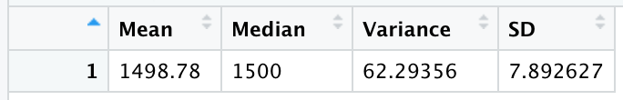
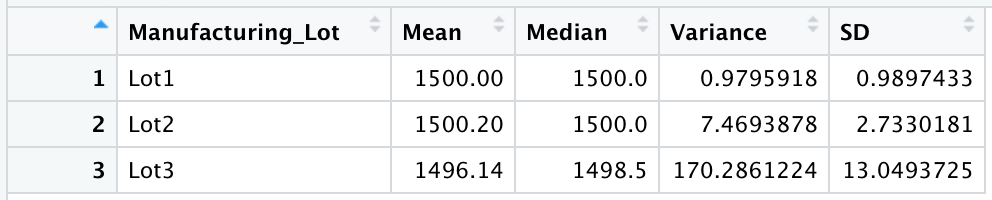
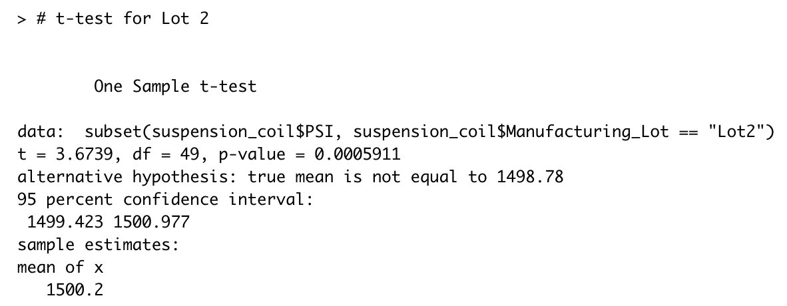

# MechaCar Statistical Analysis

## Overview

The purpose of this analysis was to offer MechaCar's production help with their manufacturing team. In order to conduct this analysis, two datsets containing information related to the miles per gallon and the suspension coils of the MechaCar we used.

## Linear Regression to Predict MPG

Using linear reggression to predict miles per gallon, the analysis provided the client to see that there are two variables that provide a non-random amount of variance. The two variables are: vehicle length and ground clearance.

The regression model also showed that the slope is not considered to be zero. The slope is not zero, because the model is showing that some of the independent variables have a significant effect on the dependent variable. A slope is only considered near or a zero slope, if none of the independent variables have an effect on the dependent variable .

Based on this model, the R-squared value is at 0.7149. This value along with the significant variables identfied suggest that the linear regression model created to predict mpg is considered effective.

Below is an image, summarizing the linear regression analysis created to predict MPG:

## Summary Statistics on Suspension Coils

#### Total Summary of Suspension Coils

#### Lot Summary of Suspension Coils

#### Analysis of the Suspension Coils
The design specifications for the MechaCar suspension coils dictate that the variance of the suspension coils must not exceed 100 pounds per square inch. The current manufacturing data does not meet this design specification for all manufacturing lots in total and each lot individually. The data does not meet the specification, because the current variance is approximately 62.29 PSI meaning that is does meet the design specification.

When looking at the lots individuals, the first two lots meet the design specification, but the third lot does not. The third lot's variance is approximately 170.29 PSI, exceeding the design specification by roughly double the alotted amount. Therefore, the manufacturing data does not meet the design specification.

## T-Tests on Suspension Coils

T-tests were performed to provide more of an analysis on suspension coils, and provide further clarity on each of the lots. Based on the t-test analyis, we can reach the following conclusion using a significance level of 95%. Looking at the p-value for all lots is at 0.06, which do meet the PSI requirement. Furthermore, lots one and two are statistically significant while lot three is not. This is because, lots one and two present to be a normal statistical distribution.

Below are images of each of the t-tests performed:

## Study Design: MechaCar vs Competition

A future statistical study that can quantify how the MechaCar performs against the competition should include cost, car color, city fuel efficiency, highway fuel efficiency, horsepower, maintenance cost, or safety rating. For this study, the focuse will be to answer the following questions with the follow responses:
* What metric or metrics are you going to test?
 
 The next metrics to test would be the safety rating, horsepower, and highway fuel efficiency. These three combined as one metric will address safety concerns of consumers. We can also test the following metrics combined to provide better insight into cost and payments for consumers: cost, car color, city fuel efficiency, and highway fuel efficiency.
 
* What is the null hypothesis or alternative hypothesis?

The null hypothesis for research on safety concerns will be: The mean of the safety rating is zero. The alternative hypothesis is that the mean of the safety rating is not zero.

* What statistical test would you use to test the hypothesis? And why?

Multiple linear regression statistical summaries will show how each of the safety variables impact the safety ratings for MechaCar and their competitors.

* What data is needed to run the statistical test?

A random sample for MechaCar and their competitor, would need to be collected for all of the subcategories we are tracking within safety concerns. Once we retrieve the data we can use R Studio to complete the analysis.
